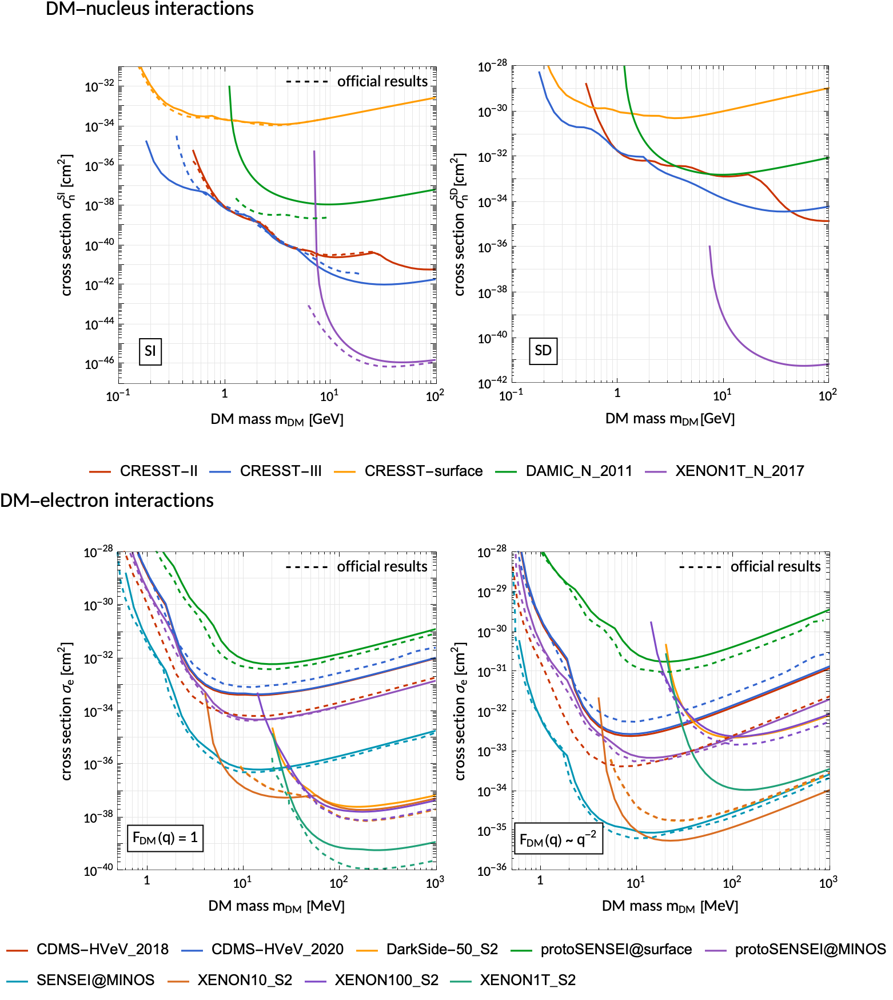

# Notes

- Plot of constraints
- Emphasize polymorphisms and modular structure
- cite ddcalc
- cite included experiments
- list statistical methods
- link to documentation
- already used in damascus-sun
- no assumption should be hard-coded, instead the code is written in terms of generic base classes agnostic to specific assumptions. number of standard ideas are implemented

# Summary

<!-- https://joss.readthedocs.io/en/latest/submitting.html#example-paper-and-bibliography -->
<!-- https://joss.readthedocs.io/en/latest/submitting.html#submission-requirements -->

The observation of a large number of gravitational anomalies on astrophysical and cosmological scales have convinced us that the majority of matter in the Universe is invisible **citation**.
This *dark matter* (DM) must be fundamentally different from the visible matter we can describe using the Standard Model of Particle Physics (SM).
Its only established property is that it interacts gravitationally and indeed dominates the gravitational potential of galaxies and galaxy clusters.
One of the leading hypothesis is that DM is made up of one or more new particles and that galaxies such as our Milky Way are embedded in gigantic haloes of these particles.
Our planet would at any moment be penetrated by a stream of these particles without much of an effect.
If these dark particles interact with nuclei and/or electrons (besides by gravity), they would on occasion collide with a terrestrial atom.
*Direct detection experiments* search for these kind of interactions and aim to observe them within a detector's target **citation**.
These experiments are typically placed deep underground to shield them from possible backgrounds e.g. due to cosmic rays.

In order to interpret the outcome of direct detection experiments, we need to make predictions for the expected events caused by the incoming DM particles.
This cannot be done without making a number of assumptions about the possible particle attributes of DM (e.g. mass and interaction strength) and the properties of the galactic DM halo (e.g. the local DM density and their energy distribution).

`obscura` is a tool to make quantitative predictions for direct DM searches, analyse experimental data, a.
It can be used to compute the expected event rates in terrestrial detectors looking for rare interactions between the DM and nuclei or electrons.
There are many different experimental techniques used in direct detection.
Additionally, due to our ignorance about DM there exists a plethora of viable assumptions and models.
This is reflected by the modular, polymorphic structure of all modules of the `obscura` library which allows to easily extend `obscura`'s functionality to the users' favorite new idea on what the DM particles could be like or behave, or to a new detection technology.

# Statement of need

 

# The modular structure of direct detection computations

<!-- As derived [@Essig:2015cda] ... -->

<!-- Single dollars ($) are required for inline mathematics e.g. $f(x) = e^{\pi/x}$

Double dollars make self-standing equations:

$$\Theta(x) = \left\{\begin{array}{l}
0\textrm{ if } x < 0\cr
1\textrm{ else}
\end{array}\right.$$

You can also use plain \LaTeX for equations
\begin{equation}\label{eq:fourier}
\hat f(\omega) = \int_{-\infty}^{\infty} f(x) e^{i\omega x} dx
\end{equation}
and refer to \autoref{eq:fourier} from text. -->

# Included experimental analyses

<!-- Figures can be included like this:

and referenced from text using \autoref{fig:example}. -->

<!-- Figure sizes can be customized by adding an optional second parameter:
{ width=20% } -->

# Citations

<!-- Citations to entries in paper.bib should be in
[rMarkdown](http://rmarkdown.rstudio.com/authoring_bibliographies_and_citations.html)
format.

For a quick reference, the following citation commands can be used:
- `@author:2001`  ->  "Author et al. (2001)"
- `[@author:2001]` -> "(Author et al., 2001)"
- `[@author1:2001; @author2:2001]` -> "(Author1 et al., 2001; Author2 et al., 2002)" -->

# Acknowledgements

# References